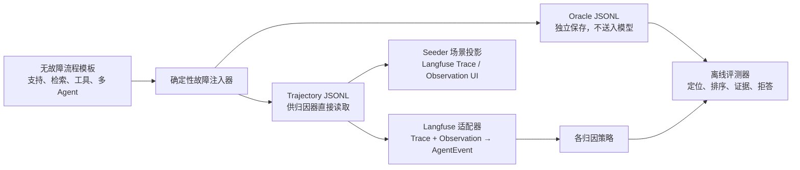

# 失败归因工具测试数据集构建计划

> 目标：为 `docs/agentdebugx-failure-attribution-analysis.md` 中审计的失败归因能力构建一个可重复生成、可自动评分、可在 Langfuse 中复现的测试数据集。本文是实施计划，不会在本次变更中写入任何测试数据。

## 1. 先确定要验证的能力

数据集的目标不是验证“某一步报错能否被找到”，而是验证归因器能否把**失败症状**和**引入失败的责任事件**区分开。每个 case 应同时提供：

- 轨迹：按时间排序的事件图，保留 `event_id`、`step_index`、agent、输入、输出、错误、父子关系和必要的工具结果；
- 运行结果：成功、失败或不可判定；
- 隐藏的金标准（oracle）：根因事件集合、失败首次显现事件、症状事件集合、可接受的等价答案，以及该 case 是否本来就不该强行归因；
- 预期评测模式：单根因、多根因、外部根因或证据不足（应 abstain）。

根因主键必须是 `event_id`。`step_index` 仅用于展示和兼容性测试；同一步可能包含 thought、LLM、tool call 与 tool result，不能作为唯一标签。这与现有分析中 DeepDebug / AllAtOnce 的 grounding 逻辑一致。

## 2. 数据集总体架构



应维护三个彼此分离的工件：

| 工件 | 建议位置 | 用途 | 不得包含 |
| --- | --- | --- | --- |
| `trajectory` | `fixtures/failure-attribution/trajectories/*.jsonl` | 归因工具的实际输入；可从 Langfuse 导入/导出 | `root_cause`、`mistake_step`、`failure_label` 等会泄漏答案的字段 |
| `oracle` | `fixtures/failure-attribution/oracles/*.jsonl` | 测试断言与评分 | 运行时供模型读取的路径或 metadata |
| `manifest` | `fixtures/failure-attribution/manifest.json` | case 索引、版本、split、生成参数、哈希 | 原始用户数据、密钥、模型供应商凭据 |

首次实现可将这些文件放在归因工具自身仓库；Langfuse 侧只增加一个可选 Seeder 场景和导出/适配测试。这样能避免把 AgentDebugX 的评测契约耦合到 Langfuse 的生产数据模型。

## 3. 标签契约

每条 oracle 至少定义下列字段：

```json
{
  "case_id": "support-wrong-refund-001",
  "split": "dev",
  "outcome": "failure",
  "root_event_ids": ["evt_decide_refund"],
  "acceptable_root_sets": [["evt_decide_refund"]],
  "failure_onset_event_id": "evt_refund_rejected",
  "symptom_event_ids": ["evt_refund_rejected", "evt_terminal"],
  "fault_family": "wrong_agent_decision",
  "identifiability": "identifiable",
  "counterfactual": {
    "intervene_on_event_id": "evt_decide_refund",
    "expected_outcome": "success"
  },
  "evidence_spans": [{"event_id": "evt_decide_refund", "field": "output", "quote": "..."}]
}
```

约束如下：

1. `root_event_ids` 表示最小充分原因，而不是最后一个 error event。
2. 多根因用 `acceptable_root_sets` 表达，避免把存在合理并列解释的 case 错误地打成单选题。
3. `identifiability=exogenous|insufficient_evidence` 时，正确答案是拒绝给出责任事件或显式降低结论；这类 case 用于防止“任何失败都归咎某一步”。
4. `evidence_spans` 必须能在对应事件的 input、output 或 error 原文中逐字找到；它用于评测解释的 grounding，而不是只评“猜中步骤”。
5. oracle 与 trace 的标识符可对应，但标签字段绝不能出现在给模型的 trajectory metadata 中。生成后增加一次泄漏扫描，拒绝 `root|cause|mistake|label|oracle` 等标签键和值出现在运行输入中。

## 4. 用模板加故障注入，而不是手写大量孤例

先制作 4 个成功的、语义完整的流程模板，再在明确的事件上施加可控突变。模板提供自然的前因、并行、重试和后续级联；注入器提供可审计的因果真值。

| 流程模板 | 可复用现有素材 | 主要覆盖 |
| --- | --- | --- |
| 支持退款 Agent | `support-agent` 的客户、工具与 ReAct 结构 | 错误决策、错误工具参数、工具拒绝、最终回复不一致 |
| RAG 问答 | `agent-timeline` 的 planner → retriever → generator → critic 循环 | 检索错误、引用缺失、批评器未阻断、循环放大 |
| 多 Agent 编排 | `agent-timeline` 的分支与汇合结构 | 路由错误、跨 agent 责任、并行症状与重复步骤号 |
| 工具/环境工作流 | 新的最小模板 | timeout、部分成功、过期缓存、外部依赖失败、不可归因 |

每个模板必须先有一条已验证成功的基线轨迹。故障版本只能改变明确的一至两个事件，并把“如果修正该事件，是否成功”的结果记录进 oracle。对于声称可修复的 case，至少跑一次真实的修复后 replay；不要用 LLM 的反事实判断替代数据集真值。

## 5. 初始语料范围与覆盖矩阵

建议先发布一个小而严格的 v0.1，而不是立即追求规模：80 个训练/开发 case、40 个隐藏测试 case、20 个压力/拒答 case。每个 case 至少有一个成功基线或同模板的成功对照。

| 维度 | 初始覆盖 | 目的 |
| --- | --- | --- |
| 根因类别 | 错误 LLM 决策、错误 tool 参数、tool/error、检索污染、编排/路由、guardrail 漏检、状态/缓存、外部环境 | 检验不同责任主体，而非只匹配 `error` 字段 |
| 因果形态 | 单根因、两个必要根因、上游根因 + 下游症状、外部根因、证据不足 | 检验定位、并列、拒答边界 |
| 轨迹结构 | 线性、树状、并行 fan-out、循环/重试、异步父节点、跨 agent | 覆盖 StepByStep、二分、DeepDebug 的结构假设 |
| 身份歧义 | 重复 `step_index`、无 step、相邻同名工具、相同文本输出、event id 缺失/非法 | 验证 event-id 优先与安全降级 |
| 可观测性 | 完整 I/O、缺 output、截断、error 仅在终止事件、噪声日志、敏感字段脱敏 | 检验鲁棒性和失败模式 |
| 长度 | 6–12 事件、30–60 事件、100–300 事件 | 比较 all-at-once、逐步、二分的预算和召回 |

切分规则：同一个流程模板、同一故障文案和同一事件位置的轻微改写不得跨 train/dev/test。隐藏测试至少包含未见过的模板组合与故障表达，防止基于 prompt 或固定步骤号的过拟合。

## 6. 分阶段实施计划

### Phase 0：冻结评测问题与成功标准

1. 明确 v0.1 只比较哪些产品入口：`heuristic`、`all_at_once`、`step_by_step`、`binary_search`、`counterfactual` 和 `deep`；SBFL/Ensemble 单列为需要跨轨迹语料的实验组。
2. 约定每个策略的预算：模型、最大调用次数、超时和重试策略；测试报告必须记录实际调用数、token/费用（若可得）与 wall-clock 时间。
3. 设定门槛：单根因 Top-1 event accuracy、Top-3 recall、失败首次显现与根因的距离、拒答 precision/recall、证据 grounding rate，以及每 case 成本的中位数/P95。门槛数值应在收集基线后冻结，避免事后调参。

产物：`dataset-spec.md`、标签 JSON Schema、评测 CLI 的输出格式。

### Phase 1：建立规范轨迹与 Langfuse 适配层

1. 定义中立的 `TrajectoryEvent` schema，字段向 AgentDebugX 的 `AgentEvent` 看齐；把 Langfuse `Trace` 映射为 run 元数据，把每个 `Observation` 映射为一个 event。
2. 映射保留 `observation.id → event_id`、`parentObservationId`、`type`、`name`、`startTime/endTime`、`input/output`、`statusMessage`、`level` 与 metadata；按开始时间稳定排序，但不因排序重写 event identity。
3. 把 `ObservationType`（AGENT、GENERATION、TOOL、RETRIEVER、GUARDRAIL 等）保留为 `event_type`，方便验证策略对“决策事件”与“环境症状”的筛选差异。
4. 为不存在 `endTime`、父节点缺失、重复 step、循环重试和跨 agent 建立适配器单元测试。导入失败应保留不确定性而非伪造唯一根因。

产物：适配器、双向 fixture、至少 12 个 mapping tests。

### Phase 2：实现成功模板与确定性故障注入器

1. 复用 `support-agent`、`agent-timeline` 的业务语义，抽出与存储无关的事件模板；随机性全部来自显式 seed，ID 由 `case_id` 派生。
2. 一个 mutation 只负责一种因果机制，例如替换 LLM decision、篡改 tool argument、让 retriever 返回冲突文档、让 router 选择错误 agent、让工具 timeout。
3. 注入器同时生成 trajectory 与 oracle，并执行结构校验：父子关系有效、事件 ID 唯一、根因先于失败显现、证据文本存在、禁止标签泄漏。
4. 每个 mutation 生成 success/failure 成对样本；有真实 replay 能力的模板，执行“修正注入点”的 replay 以确认 counterfactual 标签。

产物：4 个基线模板、8 类 mutation、约 48 个已人工审阅的 dev case。

### Phase 3：人工标注与对抗性审校

1. 两名标注者独立阅读不含 oracle 的轨迹，标注根因事件、症状、可接受候选和证据；分歧由第三人裁决。
2. 计算 event-level agreement；若单根因 case 的一致率低，优先改写轨迹或将它降级为 `ambiguous`，而不是强制一个看似精确的标签。
3. 增加 20 个“诱饵” case：终止 error 非根因、早期 warning 非根因、正确 tool 返回但后续决策错误、多个相同 step、模型文本声称成功但任务实际失败。
4. 所有人工内容使用合成客户、文档和密钥样式占位符；不得把客户 trace、生产 prompt 或真实访问令牌带入 fixture。

产物：审校记录、oracle v0.1、冻结的 hidden test split。

### Phase 4：接入 Langfuse Seeder 与端到端验收

1. 新增一个**加性** Seeder 场景，例如 `failure-attribution`，按 `--case-id` 或 `--suite` 将规范轨迹投影为 Trace + Observation；需要预览时加 `--v4`，沿用现有 v3→events_full 镜像。
2. Seeder 的职责仅是写入、readback 和输出 Trace 深链；不得在 ClickHouse 行或 Observation metadata 中写 oracle。
3. 调用 `pnpm run seed -- doctor`，再用 `--dry-run --json` 验证范围，最后用固定 `--seed` 和新的 `--id-prefix` 写入小套件。打开其输出的链接，人工确认 Observation 树、时间线、错误与 I/O 可读。
4. 在 CI 中，归因器针对 JSONL fixture 做离线评测；只对少量 smoke cases 做 Langfuse 导入/导出 round-trip，避免将数据库与 LLM 调用变成每次 PR 的硬依赖。

产物：可发现的 seed 命令、readback 断言、UI 截查清单、CI 汇总 JSON/Markdown 报告。

### Phase 5：扩展到跨轨迹与回归治理

1. 为 SBFL 单独建设 corpus：每个任务族至少 20 条 passing 与 20 条 failing run，且故障前后的无关文本、事件数与位置应有变化，避免 signature 仅记住固定前缀。
2. 将新发现的线上失败先匿名化、人工重建为合成模板，再进入 `regression` split；不直接复制生产轨迹。
3. 版本化 `dataset_version`、生成器版本、oracle 哈希和策略配置。任何 oracle 修改都要求说明“标注修正”还是“评测目标变更”。
4. 仅当 v0.1 指标稳定后，增加 GUI/OSWorld 多模态轨迹；其截图、动作和 RCA 标签应作为独立数据域，不与文本轨迹的 event 映射混用。

## 7. 评分与验收

每次评测至少输出以下维度，并按 `fault_family`、轨迹长度和 `identifiability` 分桶：

| 指标 | 判定 |
| --- | --- |
| Top-1 / Top-3 root accuracy | primary 或任一 hypothesis 是否命中 `acceptable_root_sets` |
| Onset-vs-root error | 是否错误地只选到 `failure_onset_event_id` 或终止 error |
| Evidence grounding rate | 返回证据能否在所归责 event 的原文中验证 |
| Abstention quality | 外部/证据不足 case 上不胡乱指责内部事件 |
| Calibration | confidence 分桶与实际命中率的偏差；不能把未校准分数当概率 |
| 成本与延迟 | 每个 case 的模型调用、token/费用（若有）、耗时 P50/P95 |
| 稳定性 | 相同 case 与固定模型配置重复 N 次的 Top-1 方差 |

验收的最低条件不是某个模型分数“看起来很高”，而是：所有 fixture 通过 schema、泄漏、结构、证据与确定性校验；基线策略有可比较的报告；至少一个正例、一个级联症状、一个重复步骤、一个外部根因、一个拒答 case 能完整经过 Langfuse 投影与导入适配。

## 8. 建议的实施顺序（最小可用版本）

1. 先完成 Phase 0–1：锁定 schema、oracle 和 Langfuse adapter，避免后续数据无法比较。
2. 用支持退款模板构造 12 个 single-fault paired cases，先跑 heuristic、all-at-once、deep 三个代表策略，确认评分器有区分度。
3. 加入 RAG 与多 Agent 模板，把集数扩到 48；再引入重复步骤、并行和终止 error 诱饵。
4. 冻结 20 个 hidden cases，接入 Seeder 进行 UI / round-trip 验收。
5. 最后再建设 SBFL 的跨轨迹语料和 GUI 多模态集；它们的数据需求和评测语义不同，不应阻塞 v0.1。

## 9. 风险与防线

- **把错误事件当根因**：用 onset/root 双标签和级联样本强制区分。
- **标签泄漏**：oracle 与 trajectory 物理分离，生成与 CI 都执行关键字/字段扫描。
- **合成语料过于规整**：同一 mutation 在多个模板、位置、措辞与噪声条件下生成，hidden split 不复用模板变体。
- **“反事实”无证据**：仅把真实修复 replay 的结果标为可修复；模型模拟只作为被测策略的输出。
- **Seeder 绕开真实摄取链路**：将其定位为 UI 投影；对少量 smoke case 增加 ingestion/export round-trip，不把直写数据误称为摄取测试。
- **LLM 不确定性掩盖回归**：固定模型和参数，重复采样并同时保留零调用的 heuristic 基线。

## 10. 与当前仓库的落点

- 现有业务形状优先来自 `packages/shared/scripts/seeder/scenarios/support-agent.ts` 与 `packages/shared/scripts/seeder/scenarios/agent-timeline.ts`。
- Langfuse 数据字段以 `packages/shared/src/domain/traces.ts`、`packages/shared/src/domain/observations.ts` 为准。
- Seeder 扩展必须遵守 `packages/shared/scripts/seeder/AGENTS.md`：场景、flags 和 JSON summary 为加性契约，使用确定性 `Rng`，并以 ClickHouse readback 验证。
- 归因策略、已知覆盖缺口和不应误解为因果证明的边界，见 [AgentDebugX 失败归因实现分析](./agentdebugx-failure-attribution-analysis.md)。
