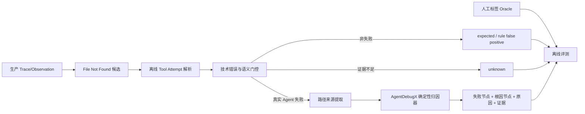

# 基于生产 Trace 数据的 File Not Found 失败归因 MVP Plan

> 约束：当前只能从实际生产数据中抽取 Langfuse Trace/Observation，并对样本进行人工标注；不能要求新增线上埋点，不能依赖环境 replay，也不把 LLM 作为 MVP 必需组件。
>
> 周期：1–2 周；初始数据集约 50 条人工标注 Case。

## 1. MVP 目标

建立一条可重复执行的离线归因链路：



MVP 要证明的不是“任何 File Not Found 都能自动找到根因”，而是：

- 规则命中的技术错误可以被复核；
- 预期探测等语义负例不会被强行归因；
- 有明确 Trace 证据时，能把错误显现节点与责任来源节点区分开；
- 证据缺失或歧义时稳定返回 `unknown`。

## 2. MVP 输出类别

50 条样本不足以稳定评估大量细分类别，第一版只保留四个主输出：

| 输出 | 含义 | 是否需要根因节点 |
| --- | --- | ---: |
| `not_agent_failure` | 规则误报、预期探测、正常控制流或合理探索 | 否 |
| `user_path_invalid` | 失败路径来自用户输入，Agent 没有实质性改变 | 是 |
| `model_path_hallucination` | 路径由模型首次产生，之前没有可信来源 | 是 |
| `unknown` | Tool 配对、语义或路径来源证据不足 | 否 |

同时保留辅助字段，便于以后扩展：

```text
not_agent_failure_reason:
  rule_false_positive | validation_probe | control_flow | recovered_exploration

other_cause_hint:
  upstream | runtime | tool | environment | ambiguous
```

Skill/System/前序 Tool 路径错误与运行环境不可见，第一版不作为强制分类目标。只有证据非常充分时记录 `other_cause_hint`，主要评测中仍并入 `unknown`。这是因为生产 Trace 通常不能证明文件在调用前是否真实存在，也不能还原容器挂载、cwd 和权限状态。

## 3. 样本单位与数据契约

一条 Case 定义为：

> 一条 Trace 中，由规则命中的一次疑似失败 Tool Attempt。

同一 Trace 中有两个失败 Tool Attempt，应产生两个 Case，但共享同一 Trace/Observation 快照。

### 3.1 输入数据

```json
{
  "case_id": "fnf-0001",
  "trace": {
    "id": "trace-id",
    "timestamp": "...",
    "input": {},
    "output": {},
    "metadata": {}
  },
  "observations": [
    {
      "id": "observation-id",
      "trace_id": "trace-id",
      "parent_observation_id": null,
      "type": "TOOL",
      "name": "read_file",
      "start_time": "...",
      "end_time": "...",
      "level": "ERROR",
      "status_message": "File not found",
      "input": {},
      "output": {},
      "metadata": {}
    }
  ],
  "candidate": {
    "matched_observation_id": "tool-result-id",
    "rule_id": "file-not-found-v1",
    "matched_field": "status_message",
    "matched_text_redacted": "File not found: <PATH>"
  }
}
```

### 3.2 人工 Oracle

```json
{
  "case_id": "fnf-0001",
  "technical_error_review": "confirmed",
  "semantic_label": "unexpected_failure",
  "is_agent_failure": true,
  "is_task_failure": true,
  "was_recovered": false,
  "failure_observation_ids": ["tool-result-id"],
  "primary_failure_observation_id": "tool-result-id",
  "root_cause_observation_ids": ["generation-id"],
  "primary_root_cause_observation_id": "generation-id",
  "root_cause_label": "model_path_hallucination",
  "path_source_kind": "model",
  "path_source_observation_id": "generation-id",
  "evidence_observation_ids": ["generation-id", "tool-result-id"],
  "annotation_confidence": "high",
  "notes": "错误路径第一次出现在模型产生的 Tool Call 中。"
}
```

原始数据和 Oracle 必须分文件保存。评测时归因器只能读取 Trace/Observation 与 candidate，不能读取人工标签。

## 4. 50 条数据集的构建方式

### 4.1 不按类别硬造比例

先连续审阅规则召回的真实样本并记录生产分布。为了保证评测覆盖，可以从候选池补充稀有类型，但要在 manifest 中区分：

```text
sampling_mode = natural_distribution | coverage_oversample
```

不能把补采后的比例描述成生产真实比例。

### 4.2 建议覆盖底线

| 类型 | 最低希望数量 | 说明 |
| --- | ---: | --- |
| 规则误报或预期 Not Found | 10 | 验证系统不会看到错误文本就强行归因 |
| 用户路径错误 | 8 | 最容易产生高精度归因 |
| 模型路径臆造 | 8 | 核心价值场景 |
| 已恢复失败 | 5 | 区分 Agent 局部失败和任务最终失败 |
| unknown/歧义 | 8 | 验证拒答能力 |

类别可以重叠，例如一条模型路径臆造也可能是已恢复失败。若真实数据无法满足某类数量，应报告缺口，不要降低标签标准。

### 4.3 开发/测试划分

- 前 30 条：开发集，用于观察数据形态、开发规则与修复转换器；
- 后 20 条：测试集，冻结标签后不得再根据结果调整规则；
- 同一 Trace 的所有 Case 必须进入同一 split；
- 报告使用“命中数/总数”，百分比仅作辅助，例如 `6/8 (75%)`。

如果 50 条完成后类别分布极不均衡，先把全部数据称为 pilot set，不宣称泛化性能。

## 5. 技术实现拆分

## P0. 数据冻结与隐私检查

目标：先得到不可变、可重复读取的数据集快照。

任务：

1. 从规则结果取得 `project_id + trace_id + matched_observation_id + timestamp`；
2. 按 Trace ID 加载完整 Trace 与 Observation 树；
3. 保留 ID、父子关系、类型、名称、时间、input/output、level、status message 和必要 metadata；
4. 对路径、用户标识、密钥和内部主机信息进行一致性脱敏；同一 Case 中同一路径必须映射成同一占位符；
5. 输出 `traces.jsonl`、`observations.jsonl`、`cases.jsonl` 和独立 `annotations.jsonl`；
6. 计算每个文件的哈希并写入 `manifest.json`。

ClickHouse 查询要求：

- Per `schema-pk-filter-on-orderby`，候选扫描和 Trace 加载必须包含 `project_id`，并尽量带时间条件；
- Per `query-join-filter-before`，先过滤出少量候选 Trace ID，再加载这些 Trace 的 Observation；
- Per `query-join-consider-alternatives`，50 条 MVP 使用两阶段查询，不在 ClickHouse 中做全量 Trace/Observation 大 JOIN；
- V4 `events` 读取复用现有 query builder/repository，不使用 `FINAL`；
- 生产数据仅做只读查询，不增加 ClickHouse schema，也不写回人工标签。

验收：同一快照重复运行解析器产生相同 Case ID 和 Observation 顺序；Oracle 不出现在输入文件中。

## P1. 离线 Tool Attempt Resolver

目标：从真实 Observation 结构中确定失败 Tool Call 与 Tool Result。

配对优先级：

1. 显式 `tool_call_id` 或 metadata 中的关联 ID；
2. `parent_observation_id`；
3. 同一父节点、相同 Tool 名称与时间顺序；
4. 无法唯一配对时输出 `pairing_status=ambiguous`。

输出：

```json
{
  "tool_name": "read_file",
  "tool_call_observation_id": "call-id",
  "tool_result_observation_id": "result-id",
  "pairing_status": "paired",
  "path_argument": "<PATH>/report.md",
  "path_argument_key": "path",
  "error_code": "ENOENT"
}
```

支持的路径字段只做 MVP 必要集合：`path`、`file`、`filename`、`file_path`。无法识别参数时输出 `unknown`，不从错误消息臆造完整参数。

验收：在 30 条开发集上，Tool 配对和路径提取由人工逐条核对；测试集上报告 pairing coverage。

## P2. 技术错误确认与语义门控

目标：不使用 LLM，将明显的非失败样本挡在归因之前。

### 技术事实规则

确认条件：

- 命中内容位于本次 Tool Result 的结构化 error、status message 或失败状态；
- 错误码/错误文本符合 `ENOENT`、`file not found`、`no such file or directory`；
- Tool Attempt 能配对，或至少 matched Observation 可明确识别为执行结果。

否则输出 `rule_false_positive` 或 `unknown`。

### 高精度语义负例规则

MVP 只自动识别证据明确的情况：

- 用户明确要求检查路径不存在；
- Tool 语义本身为 `exists`、`stat`、`check`、`probe`；
- File Not Found 后立即创建/写入同一路径并成功；
- 失败路径属于候选搜索，后续读取另一路径成功且任务完成；
- Trace 明确通过该错误进入预期分支并成功结束。

不满足负例规则不代表一定是 Agent 失败。门控输出三值：

```text
not_agent_failure
failure_candidate
unknown
```

优先保证 `not_agent_failure` 的 precision，语义模糊时返回 `unknown`。

验收：测试集上单独报告语义负例 precision/recall，以及被错误强行归因的负例数量。

## P3. 离线路径来源提取器

目标：从历史 Trace 自身重建最小 provenance，不依赖新增线上 metadata。

算法：

1. 取失败 Tool Call 的路径参数，并进行轻量规范化：统一分隔符、处理 `./`、结合已知 cwd、保留 basename；
2. 只扫描 Tool Call 之前的 Observation；
3. 按原文出现和结构字段匹配路径；
4. 找到最早的可信来源 Observation；
5. 多个不同主体同时包含路径或路径经过不可还原转换时返回 `unknown`。

来源判定：

```text
Trace input / user message 首次提供  → user
Generation 首次产生                → model
Skill/System/前序 Tool Result       → upstream_hint
无唯一来源                         → unknown
```

不要把“模型在 Tool Call 中重复了用户路径”标为模型臆造。只有路径在用户、系统、Skill 和前序 Tool Result 中都没有出现，且首次出现在模型决策/Tool Call 中时，才能输出 `model`。

输出转换为现有 AgentDebugX 契约：

```json
{
  "kind": "tool_call",
  "tool_name": "read_file",
  "arguments": {"path": "<PATH>/missing.md"},
  "argument_sources": {
    "path": {
      "kind": "model",
      "observation_id": "generation-id"
    }
  }
}
```

验收：测试集上报告 path source classification 和 source Observation Top-1；人工不确定样本不计入强制分类准确率，但纳入拒答评测。

## P4. AgentDebugX 适配与归因 Pipeline

目标：最小改造现有 Langfuse 集成，复用确定性归因内核。

建议新增：

```text
agentdebug/integrations/langfuse_attribution/
├── historical_converter.py  # 原始生产 Observation → 结构化 evidence
├── failure_gate.py          # technical + semantic 三值门控
├── pipeline.py              # 门控后调用 LangfuseToolAttributor
└── evaluation.py            # prediction 与 Oracle 比较
```

现有组件复用：

- `converter.py`：保留 detector-safe trajectory 设计；
- `LangfuseToolAttributor`：复用 `user/model/skill/runtime/unknown` 分类；
- `models.py`：扩展统一结果字段；
- `presentation.py`：复用安全输出原则，不回传原始路径。

Pipeline 输出：

```json
{
  "case_id": "fnf-0001",
  "technical_condition": "file_not_found",
  "decision": "attributed",
  "is_agent_failure": true,
  "is_task_failure": null,
  "failure_observation_id": "tool-result-id",
  "root_cause_observation_id": "generation-id",
  "root_cause_label": "model_path_hallucination",
  "evidence_observation_ids": ["generation-id", "tool-result-id"],
  "confidence": 0.95,
  "reason_codes": ["path_first_seen_in_model", "enoent_confirmed"]
}
```

`decision` 必须支持：

```text
not_agent_failure
attributed
unknown
invalid_case
```

MVP 不要求自动判断最终 `is_task_failure`。如果仅靠 Trace output 和后续 Observation 无法确定任务结果，输出 null；该字段仍由人工标签评测和分析。

## P5. 离线评测器

目标：验证规则门控、路径来源与根因节点定位，而不是只看一个总准确率。

指标：

| 层级 | 指标 |
| --- | --- |
| 技术事实 | 规则候选 precision，误报数量 |
| 语义门控 | `not_agent_failure` precision/recall，强行归因负例数 |
| 归因适用性 | attributed / unknown 的覆盖率与准确率 |
| 原因分类 | `user_path_invalid`、`model_path_hallucination` 的逐类命中数 |
| 根因节点 | source/root Observation Top-1 |
| 错误/根因区分 | 把 Tool Result 错选为根因的数量 |
| 拒答 | unknown precision，以及本可归因却拒答的数量 |
| 证据 | evidence Observation 是否均存在且支持结论 |

报告示例：

```text
测试集：20 cases
技术错误确认：18/20
语义负例识别：4/5
真实失败中成功归因：9/12
根因 Observation Top-1：8/9
错误显现节点误作根因：1
unknown：4 cases，其中正确拒答 3
```

50 条数据不用于模型训练，不报告具有统计显著性的泛化结论。

## 6. 1–2 周排期

### Day 1–2：冻结数据与标签

- 完成 30 条开发集、20 条测试集划分；
- 统一脱敏和快照格式；
- 冻结四类输出、unknown 标准和 Observation 节点标签；
- 选择 10 条代表性 Case 作为开发 fixtures。

交付：`manifest.json`、四个 JSONL 文件、标签说明、10 个 fixtures。

### Day 3–4：Tool Attempt Resolver

- 实现 Call/Result 配对；
- 提取路径参数和错误码；
- 对歧义和缺失结构返回显式状态；
- 为真实数据中的主要 Observation 形状补单元测试。

交付：配对覆盖率与失败原因统计。

### Day 5–6：Failure Gate

- 实现技术事实确认；
- 实现高精度预期探测/控制流规则；
- 输出三值门控；
- 用开发集分析 false positive，不查看测试集调规则。

交付：开发集门控混淆矩阵。

### Day 7–8：Provenance Extractor + AgentDebugX

- 实现路径规范化和向前来源搜索；
- 生成 `argument_sources` evidence；
- 增加 Pipeline 和统一结果协议；
- 复用 `LangfuseToolAttributor` 执行确定性归因。

交付：端到端 CLI，可输入一个 Case 或整个 JSONL。

### Day 9：评测与错误切片

- 冻结规则/代码版本；
- 首次运行 20 条测试集；
- 输出分层指标、逐 Case 预测和错误原因；
- 对 `unknown`、误报、错误根因分别统计。

交付：`predictions.jsonl`、`report.json`、`report.md`。

### Day 10：修复工程问题与演示

- 只修复解析崩溃、数据泄漏、ID 错配等工程问题；
- 不根据测试标签重新调分类规则；
- 固化命令、README 和 3–5 个案例演示。

如只有一周，先完成 P0、P1、P3、P4、P5；Failure Gate 对语义负例暂时只做保守规则，其余输出 `unknown`。

## 7. 测试清单

### 单元测试

- Tool Call/Result 显式 ID 配对；
- 父子配对；
- 多个同名 Tool 的歧义拒绝；
- 路径字段和相对路径规范化；
- 用户路径被模型复述时仍归 user；
- 路径首次由模型产生时归 model；
- 文档正文包含 File Not Found 时识别规则误报；
- Not Found 后创建同一路径成功时识别预期控制流；
- 缺少路径、缺少 Call、上下文截断时返回 unknown；
- 输出不包含未脱敏路径或 Oracle 字段。

### 回归测试

- 保留现有 `test_langfuse_tool_attribution.py` 的结构化 evidence 测试；
- 新增历史生产形状 fixtures，确保无需 `metadata.attribution` 也能在高证据样本上重建来源；
- 同一 Case 重复执行输出完全一致；
- 根因 Observation ID 必须属于当前 Trace。

## 8. MVP 验收标准

功能验收：

- 能读取 50 条冻结 Case 并完成端到端预测；
- 每条输出 `not_agent_failure / attributed / unknown / invalid_case` 之一；
- attributed Case 同时返回错误显现 Observation、根因 Observation、原因与证据；
- 路径来源不唯一时不会强行选择；
- 无原始路径和人工标签泄漏到安全输出。

效果验收建议：

- 测试集所有 Case 均无解析崩溃；
- `not_agent_failure` precision 优先达到可用水平，目标不低于 `4/5`；
- 用户/模型两类高置信度 attributed Case 的原因分类目标不低于 `70%`；
- 已归因 Case 的根因 Observation Top-1 目标不低于 `70%`；
- 语义负例被强行归因的数量不超过 1；
- 所有无足够证据的 Case 返回 unknown，而不是伪造确定性结论。

这些门槛是 pilot 目标，不是生产 SLA。如果测试集对应分母不足 5，必须报告计数而不是只报告百分比。

## 9. 明确的非目标与风险

### 非目标

- 不训练或微调模型；
- 不保证识别所有自然语言形式的预期探测；
- 不自动区分所有 Skill/System/Runtime 子类别；
- 不证明“替换根因节点后任务一定成功”；
- 不修改生产 Trace 或写回归因结论。

### 主要风险

| 风险 | MVP 处理方式 |
| --- | --- |
| 历史 Trace 缺少 Tool 关联 | ambiguous / unknown |
| 路径经过变量拼接或变换 | 仅支持简单规范化，复杂情况 unknown |
| File Not Found 实际为环境/权限问题 | 没有环境证据时不归 model/user |
| 预期行为需要深层语义理解 | 只识别高精度规则，其余 unknown |
| 50 条类别不均衡 | 报告计数与覆盖，不宣称泛化 |
| 人工标签存在分歧 | 低置信度样本二次复核或排除主指标 |
| 生产数据泄漏 | 一致性脱敏、输入/Oracle 分离、导出扫描 |

## 10. MVP 完成后的扩展顺序

1. 根据 `unknown` 错误切片补充路径 provenance 规则；
2. 增加 `upstream_path_invalid`，再细分 Skill/System/Previous Tool；
3. 通过新增线上 metadata 提升来源和运行环境证据质量；
4. 引入 LLM 只处理确定性门控无法判断的语义样本；
5. 扩展到权限、超时、参数校验和依赖不可用；
6. 数据量足够后再评估训练分类器或使用 AgentDebugX 通用 LLM 归因器。

## 11. 最小可交付物

```text
dataset/
├── manifest.json
├── traces.jsonl
├── observations.jsonl
├── cases.jsonl
├── annotations.jsonl
└── splits/

agentdebug/integrations/langfuse_attribution/
├── historical_converter.py
├── failure_gate.py
├── pipeline.py
└── evaluation.py

outputs/
├── predictions.jsonl
├── report.json
└── report.md
```

最终演示应至少展示三个真实脱敏 Case：

1. 预期 File Not Found，系统不归因；
2. 用户提供错误路径，根因指向用户来源 Observation；
3. 模型生成错误路径，根因指向 Generation，Tool Result 仅为错误显现节点。

## 12. 后续数据集构建 TODO（本轮暂不实施）

当前长 Trace 合成集先生成全部噪声 Observation，再在尾部追加短因果链，
因此错误显现节点整体偏向 Trace 尾部。这批数据只能验证“长噪声前缀下的
上下文压缩与归因”，不能证明系统对任意错误位置和长距离因果关系都稳健。

下一版数据集必须消除这一位置捷径，并增加以下可度量维度：

- 将错误显现位置分为前部、中部、尾部并分层采样；
- 独立控制根因到错误显现节点的距离，例如相邻、20–100 个节点、
  300–800 个节点；
- 在部分 Case 的错误节点之后保留 100–500 个 Observation，覆盖恢复、
  重试、分支继续执行和最终任务结果晚到的情况；
- 在同一 Trace 中放置多个技术错误，其中包含预期错误、已恢复错误和真正
  导致任务失败的错误，避免使用“最后一个错误”作为捷径；
- 在 manifest 中记录 `failure_position_ratio`、`root_failure_distance`、
  `downstream_observation_count`、`technical_error_count` 和
  `causal_error_index`；
- 分桶报告前部/中部/尾部根因准确率、不同因果距离下的候选召回率，以及
  中间错误后的语义失败判断准确率。

在完成上述扩展前，长 Trace 实验结果应标记为尾部偏置的压力测试，不作为
生产环境位置鲁棒性的结论。
