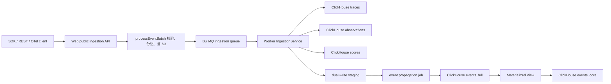

# Langfuse 数据链路、Trace 表与 Observation 代码分析

分析日期：2026-08-11

## 结论概览

Langfuse 当前内部 tracing 数据有两条并行建模路线：

1. 旧模型：以 `traces` 和 `observations` 两张 ClickHouse 实体表为核心。
2. V4 事件模型：以 `events_full` 和 `events_core` 为核心，把 trace、span、generation、score 等统一为事件。

旧模型的主链路是：SDK / REST ingestion 接入事件，Web 层校验并落 S3，再通过 BullMQ 交给 Worker 合并、补全、写入 ClickHouse。Trace 与 Observation 的关系不是数据库外键，而是通过 `project_id + trace_id` 关联，并通过 `parent_observation_id` 构成 observation 树。

Trace 列表页在旧模式下展示的是 trace 行，但很多列来自 observation 与 score 的动态聚合；在 V4 beta 模式下，列表更接近事件 / observation 视角，再用 adapter 折叠出 trace 详情结构。

## 数据链路总览



关键入口：

- Public ingestion API：`web/src/pages/api/public/ingestion.ts`
- 批处理与落 S3：`packages/shared/src/server/ingestion/processEventBatch.ts`
- Worker 队列消费：`worker/src/queues/ingestionQueue.ts`
- Worker 合并与写入：`worker/src/services/IngestionService/index.ts`
- OTel 队列：`worker/src/queues/otelIngestionQueue.ts`
- OTel 事件处理：`packages/shared/src/server/otel/OtelIngestionProcessor.ts`

## Ingestion 到 ClickHouse 的写入过程

Public ingestion 入口接收 batch 后，主要做鉴权、schema 校验、event 拆分、元数据补齐，然后把原始事件写入 blob storage / S3，并把引用信息推入 ingestion queue。

Worker 侧的 `IngestionService` 再从队列取回事件，按事件类型拆分成 trace、observation、score 等领域对象。这里会处理 upsert / create 的合并语义，并把最终行写到 ClickHouse。

旧表使用 ClickHouse 的 `ReplacingMergeTree` 风格，因此同一个逻辑实体可能被多次写入，最终以时间戳或版本语义决定可见版本。代码查询时也大量依赖 `FINAL`、最新行聚合或按时间排序来规避重复版本。

需要注意的是，ingestion API 的成功响应只表示事件被接受和排队，不等于 trace / observation 已经立即能在 UI 查询到。S3、BullMQ、Worker、ClickHouse 写入以及 V4 propagation 都会带来异步可见性。

## Trace 表模型

旧模型中的 `traces` 表是 trace 级实体表。核心字段包括：

- `id`
- `project_id`
- `timestamp`
- `name`
- `user_id`
- `session_id`
- `metadata`
- `tags`
- `release`
- `version`
- `environment`
- `public`
- `bookmarked`

Trace 表本身保存的是 trace 级属性，不直接保存完整调用树。完整调用树由同一个 `project_id + trace_id` 下的 observations 组成。

ClickHouse migration 入口：

- `packages/shared/clickhouse/migrations/clustered/0001_traces.up.sql`
- `packages/shared/clickhouse/migrations/clustered/0002_observations.up.sql`

## Observation 表模型

`observations` 表承载 span、generation、event 等 trace 内部节点。关键字段包括：

- `id`
- `project_id`
- `trace_id`
- `parent_observation_id`
- `type`
- `name`
- `start_time`
- `end_time`
- `input`
- `output`
- `metadata`
- `level`
- `status_message`
- `model`
- `usage_details`
- `cost_details`

关系语义：

- `observations.trace_id` 指向对应 trace 的 `id`。
- `observations.parent_observation_id` 指向同一 trace 内的父 observation。
- 根 observation 的 `parent_observation_id` 通常为空。
- 这些关系在 ClickHouse 中不是强制外键，需要查询和应用逻辑保证租户隔离与树结构正确。

领域模型入口：

- `packages/shared/src/domain/observations.ts`
- `packages/shared/src/domain/traces.ts`

## Trace 列表页的数据来源

Trace 列表页入口是：

- `web/src/pages/project/[projectId]/traces/index.tsx`

页面根据运行时开关决定走旧 trace table 还是 V4 beta events table。旧模式下使用：

- `web/src/components/table/use-cases/traces.tsx`
- `web/src/server/api/routers/traces.ts`
- `packages/shared/src/server/services/traces-ui-table-service.ts`

旧 Trace table 的特点是：基础行来自 `traces`，但展示列并不只来自 `traces`。例如 latency、token、cost、model、input、output、scores 等列，需要从 observations 和 scores 聚合或取样得到。

因此旧 Trace table 更准确地说是一个 trace 视图：

- trace 基础属性来自 `traces`
- 性能和成本指标来自 `observations`
- 评分列来自 `scores`
- 输入输出列可能来自 trace 本身，也可能来自子 observation 的聚合或动态字段

这也是为什么列表查询服务里会有较多动态字段、聚合字段和 query fragment。

相关查询 fragment：

- `packages/shared/src/server/queries/clickhouse-sql/query-fragments.ts`

## Trace 详情与 Observation 树

旧模式下，trace 详情通常通过 trace id 拉取 trace、observations、scores，再在应用层构造树。

典型入口：

- `web/src/server/api/routers/traces.ts`
- `web/src/components/trace/TracePageContent.tsx`

构树逻辑的核心是：

1. 查询同一个 `project_id + trace_id` 下所有 observations。
2. 用 `parent_observation_id` 建立父子关系。
3. 没有父节点的 observation 作为根节点。
4. 再把 scores、metrics、usage、cost 等信息附加到对应 trace 或 observation 上。

这个设计意味着 trace 详情页看到的调用树主要由 observations 决定；trace 行本身更像整棵树的顶层元信息。

## V4 事件模型

V4 模型把 trace、span、generation、score 等统一进入事件表。开发脚本里可以看到 `events_full` 与 `events_core` 的建表逻辑：

- `packages/shared/clickhouse/scripts/dev-tables.sh`

大致结构：

- `events_full`：更完整的事件明细表。
- `events_core`：通过 materialized view 从 full 表投影出的核心查询表。
- propagation job：把 legacy / staging 事件继续传播进 V4 events 表。

关键入口：

- `worker/src/features/eventPropagation/handleEventPropagationJob.ts`
- `packages/shared/src/server/repositories/events.ts`
- `web/src/features/events/server/eventsRouter.ts`
- `web/src/features/events/hooks/useEventsTableData.ts`
- `web/src/features/events/lib/eventsToTraceAdapter.ts`

V4 trace 详情并不是依赖旧 `traces` 表直接还原，而是从同一个 `trace_id` 下的事件集合中合成 trace 结构。`eventsToTraceAdapter` 负责把事件模型适配成 UI 需要的 trace / observation 树形数据。

运行时开关相关入口：

- `worker/src/env.ts`

## Trace 表 UI：旧模式与 V4 模式差异

旧模式：

- `/traces` 展示一行一个 trace。
- 查询主体是 `traces`。
- observation、score、cost、latency 是附加聚合。
- 详情页通过 trace id 查询 observations 后构建树。

V4 beta 模式：

- `/traces` 页面切到 events table 体系。
- 列表数据来自 events 查询。
- UI 使用 adapter 将事件集合转成 trace 结构。
- 数据一致性取决于 dual write / propagation 是否完成。

这两种模式在 UI 上都服务于“trace 浏览”，但底层查询对象不同。调试列表缺失、指标不一致或详情树错位时，需要先确认当前项目是否走 V4 beta。

## ClickHouse 查询与表设计注意点

本次分析重点检查了和 trace / observation 相关的 ClickHouse 实现，并对照了仓库内的 ClickHouse best practices 中这些规则：

- `schema-pk-filter-on-orderby`：查询常用过滤条件应与 `ORDER BY` / 排序键配合，避免大范围扫描。
- `query-mv-incremental`：materialized view 应按增量写入理解，不能假设它会回填历史数据。
- `query-join-filter-before`：JOIN 前应尽量先按 `project_id`、时间范围、trace id 等条件裁剪数据。

对当前链路的实际影响：

- Trace 与 Observation 查询必须始终带 `project_id`，否则存在跨租户数据扫描风险。
- 时间范围过滤对 `traces` / `observations` / `events_core` 都很关键。
- V4 的 `events_core` 来自 MV 投影，历史数据是否进入 core 取决于建表、回填和 propagation 路径。
- `ReplacingMergeTree` 表存在最终一致性语义，查询新写入或刚更新的数据时要考虑 merge 延迟。

## 调试建议

排查 trace 或 observation 数据问题时，建议按以下顺序确认：

1. Public ingestion API 是否返回接受成功。
2. `processEventBatch` 是否把 batch 正确落到 S3。
3. ingestion queue 是否产生并被 worker 消费。
4. `IngestionService` 是否把 trace / observation / score 写入 ClickHouse。
5. 旧 UI 查询是否能在 `traces` 和 `observations` 中查到对应 `project_id + trace_id`。
6. 如果开启 V4 beta，再检查 staging、event propagation、`events_full`、`events_core`。
7. Trace 详情树错位时，重点看 `parent_observation_id` 是否为空、错误、跨 trace 或指向不存在节点。

## 源码索引

| 关注点 | 文件 |
| --- | --- |
| Public ingestion API | `web/src/pages/api/public/ingestion.ts` |
| Ingestion batch 处理 | `packages/shared/src/server/ingestion/processEventBatch.ts` |
| Ingestion queue | `worker/src/queues/ingestionQueue.ts` |
| Worker ingestion service | `worker/src/services/IngestionService/index.ts` |
| Observation domain model | `packages/shared/src/domain/observations.ts` |
| Trace ClickHouse migration | `packages/shared/clickhouse/migrations/clustered/0001_traces.up.sql` |
| Observation ClickHouse migration | `packages/shared/clickhouse/migrations/clustered/0002_observations.up.sql` |
| OTel queue | `worker/src/queues/otelIngestionQueue.ts` |
| OTel processor | `packages/shared/src/server/otel/OtelIngestionProcessor.ts` |
| Event propagation | `worker/src/features/eventPropagation/handleEventPropagationJob.ts` |
| Events repository | `packages/shared/src/server/repositories/events.ts` |
| Trace page route | `web/src/pages/project/[projectId]/traces/index.tsx` |
| Legacy trace table | `web/src/components/table/use-cases/traces.tsx` |
| Trace UI table service | `packages/shared/src/server/services/traces-ui-table-service.ts` |
| Trace tRPC router | `web/src/server/api/routers/traces.ts` |
| Events router | `web/src/features/events/server/eventsRouter.ts` |
| Events table hook | `web/src/features/events/hooks/useEventsTableData.ts` |
| Events to trace adapter | `web/src/features/events/lib/eventsToTraceAdapter.ts` |
| ClickHouse query fragments | `packages/shared/src/server/queries/clickhouse-sql/query-fragments.ts` |
| V4 dev table definitions | `packages/shared/clickhouse/scripts/dev-tables.sh` |
| Runtime env flags | `worker/src/env.ts` |

## 简短心智模型

可以把旧链路理解成：

```text
trace = 一次请求 / 会话片段的顶层元信息
observation = trace 内部的一棵调用树节点
score = 挂在 trace 或 observation 上的评价
trace table = traces + observations + scores 聚合出来的查询视图
```

可以把 V4 链路理解成：

```text
event = 统一事实记录
events_full = 完整事件事实表
events_core = 为高频查询裁剪后的核心事件表
trace UI = 从同 trace_id 的事件集合里合成出来的视图
```
