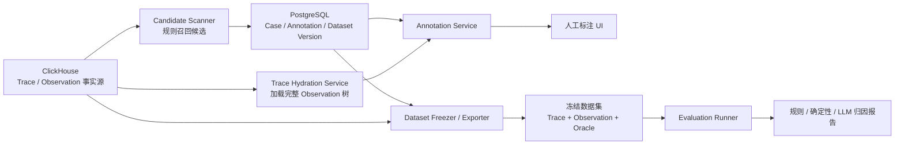
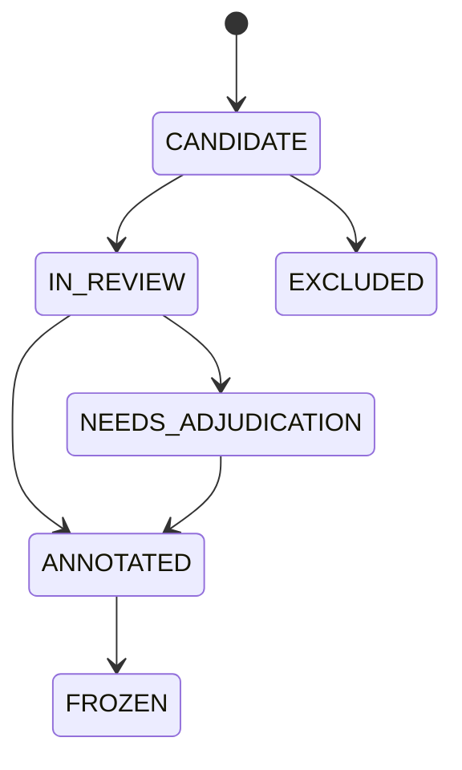

# Tool 失败归因：技术 Feature Spec

> Feature 名称：Tool Failure Attribution Dataset & Evaluation
>
> 目标：从 Langfuse 的 Trace/Observation 中筛选疑似 Tool 错误，支持人工判断错误语义、标注错误显现节点和根因节点，并将标注结果用于失败归因算法的训练、回归测试与效果评测。

## 1. Feature 定义

### 用户故事

作为 Agent 可靠性工程师，我希望：

1. 从指定项目和时间范围中批量发现疑似失败的 Tool Attempt；
2. 在完整 Observation 树上下文中判断关键字命中是否是真实技术错误；
3. 判断该技术结果是否构成 Agent 失败或最终任务失败；
4. 对真实失败选择错误显现节点、根因节点、责任域和证据；
5. 将冻结的数据与标签导出为版本化数据集；
6. 使用同一数据集评测规则、确定性归因器和 LLM 归因器。

### 核心价值

该 Feature 将下列三个问题分开处理：

```text
技术事实：是否真的发生了 Tool 技术错误？
    ↓
业务语义：该结果是否构成 Agent 或任务失败？
    ↓
因果归因：错误在哪里显现，责任由哪个节点引入？
```

关键字规则只负责召回候选，不作为失败真值。

## 2. MVP 范围

### 包含

- 数据源：Langfuse `traces`、`observations`，并兼容 V4 `events` 读取路径；
- 初始失败族：`file_not_found`；
- 样本单位：一条 Trace 中的一次 Tool Attempt；
- 人工标签：规则纠错、结果语义、Agent/任务结果、恢复状态、错误显现节点、根因节点、责任域、证据和标注置信度；
- 数据集冻结与 JSONL 导出；
- 规则基线、现有 Langfuse Tool Attributor 和 AgentDebugX 归因器的离线评测；
- 项目级访问控制、审计与脱敏。

### 暂不包含

- 自动修改生产 Trace/Observation；
- 直接用模型输出覆盖人工标签；
- 在线阻断 Agent 执行；
- GUI/OSWorld 多模态失败；
- 真实环境自动 replay；
- 将 LLM 反事实判断当作已验证因果关系。

## 3. 技术架构



### 存储职责

| 存储 | 负责内容 | 不负责内容 |
| --- | --- | --- |
| ClickHouse | 原始 Trace/Observation、候选扫描、Trace 上下文读取 | 标注状态、人工标签、频繁更新 |
| PostgreSQL | Case 生命周期、任务领取、人工 Annotation、数据集版本、评测运行元数据 | 大规模重复保存完整 Trace I/O |
| 对象存储 | 冻结后的 JSONL/Parquet、脱敏快照、评测报告 | 在线标注事务 |

MVP 不修改 ClickHouse 表结构。标注是频繁更新的事务数据，应放入 PostgreSQL，而不是对 ClickHouse 行做 mutation。

## 4. 技术模块拆分

### F1. Candidate Scanner：候选发现

职责：在一个项目和时间范围内，从 Tool Observation 中找出匹配规则的疑似技术错误。

输入：

```ts
type CandidateScanInput = {
  projectId: string;
  from: Date;
  to: Date;
  ruleSetVersion: string;
  cursor?: string;
  limit: number;
};
```

输出：

```ts
type CandidateMatch = {
  traceId: string;
  matchedObservationId: string;
  matchedField: "status_message" | "output" | "metadata";
  ruleId: string;
  ruleVersion: string;
  matchedTextRedacted: string;
  observationTimestamp: Date;
};
```

技术要求：

- 必须使用 `project_id` 与时间范围过滤，实现租户隔离和分区裁剪；
- 先过滤 `project_id`、时间、Observation 类型/名称，再执行文本规则；
- 候选扫描只选 ID、时间、错误字段等必要列，不读取整条 Trace 的全部 I/O；
- 扫描结果按 `(projectId, ruleVersion, matchedObservationId)` 幂等写入 Case；
- 首次支持 `file not found`、`ENOENT`、`no such file or directory`；每个规则必须有独立版本；
- 匹配字段和命中文本必须保留，以便分析规则误报来源。

ClickHouse 约束：

- Per `schema-pk-filter-on-orderby`，查询必须包含租户键和时间等排序键前缀，不能只在全表上搜索错误文本；
- Per `query-join-filter-before`，如果需要关联 Tool Call/Result，必须先缩小候选 Observation，再关联上下文；
- Per `query-join-consider-alternatives`，MVP 优先分两步查询——先找候选 ID，再按 Trace ID hydrate——避免在候选扫描热路径中反复大表 JOIN；
- 如果只需要一个配对结果，Per `query-join-use-any` 可使用 `ANY JOIN`，但优先复用现有 Observation 仓储和应用层配对逻辑；
- 不对 `events` 查询使用 `FINAL`，V4 读取优先复用现有 event query builder/仓储。

### F2. Tool Attempt Resolver：调用配对

职责：把规则命中的 Observation 解析成一次完整 Tool Attempt。

解析结果：

```ts
type ToolAttempt = {
  toolName: string;
  toolCallObservationId: string | null;
  toolResultObservationId: string;
  argumentSourceCandidateObservationIds: string[];
  retryGroupId: string | null;
  attemptIndex: number | null;
  errorCode: string | null;
  pairingStatus: "paired" | "ambiguous" | "missing_call";
};
```

配对优先级：

1. 显式 Tool Call ID；
2. 父子关系 `parent_observation_id`；
3. 同一父节点、Tool 名称和时间窗口；
4. 无法唯一确定时标为 `ambiguous`，禁止静默选择最近节点。

配对歧义本身是高价值数据质量标签，不应直接丢弃。

### F3. Trace Hydration Service：上下文加载

职责：标注时按需加载 Trace 和完整 Observation 树。

实现要求：

- 应复用 `getTraceById(...)` 路由包装器和现有 Observation reader，以兼容旧 `traces/observations` 与 V4 `events`；
- 所有读取携带 `projectId`；
- 默认先加载结构、类型、名称、时间、level/status；用户打开节点时再加载大体积 input/output；
- 超过 10,000 个 Observation 或响应体限制时返回 `context_truncated=true`，不得让标注者误以为上下文完整；
- 生成稳定的 UI 顺序，但所有标签均引用 `observation_id`，不以数组下标或 step 作为主键；
- 记录快照时间和源行更新时间，检测标注期间 Trace 是否发生变化。

### F4. Case Service：样本生命周期

建议增加独立 PostgreSQL 模型，而不是把富标签全部塞入 Score：

```text
FailureAttributionCase
├── id
├── projectId
├── traceId
├── candidateObservationId
├── toolCallObservationId?
├── toolResultObservationId
├── ruleId / ruleVersion
├── matchedField / matchedTextRedacted
├── pairingStatus
├── status
├── assignedToUserId?
├── lockedAt?
├── createdAt / updatedAt
└── unique(projectId, ruleVersion, candidateObservationId)
```

状态机：



可复用 Annotation Queue 的领取、锁定和人员分配能力，但 Case 仍需独立实体，因为一个 Trace 可以包含多个 Tool Attempt，且标签结构远超单个 Score。

### F5. Annotation Service：人工标注

Annotation 建议版本化保存，更新产生新 revision，不覆盖历史：

```ts
type FailureAttributionAnnotation = {
  technicalErrorReview: {
    humanLabel: "confirmed" | "rule_false_positive" | "insufficient_evidence";
    correctionReason?: string;
  };
  semanticOutcome?: {
    toolResultSemantics:
      | "unexpected_failure"
      | "expected_negative_result"
      | "validation_probe"
      | "control_flow_signal"
      | "recovered_failure"
      | "tolerated_failure"
      | "user_requested_negative_test"
      | "external_failure"
      | "unknown";
    isAgentFailure: boolean;
    isTaskFailure: boolean;
    wasRecovered: boolean;
    recoveryObservationId?: string;
  };
  failureManifestation?: {
    failureOnsetObservationId: string;
    primaryFailureObservationId: string;
    failureObservationIds: string[];
    downstreamSymptomObservationIds: string[];
  };
  attribution?: {
    applicable: boolean;
    primaryRootCauseObservationId?: string;
    rootCauseObservationIds: string[];
    rootCauseDomain?: string;
    rootCauseCategory?: string;
    evidenceObservationIds: string[];
  };
  confidence: "high" | "medium" | "low";
  notes?: string;
};
```

服务端校验规则：

- `rule_false_positive` 时不允许填写失败节点和根因；
- `confirmed` 后才允许填写结果语义；
- `isAgentFailure=false` 时 `attribution.applicable` 默认必须为 false；
- `attribution.applicable=true` 时必须有 primary root cause、至少一个根因节点和证据节点；
- 所有引用的 Observation 必须属于同一 `projectId + traceId`；
- failure/root/evidence ID 必须在当前快照中存在；
- `validation_probe` 等语义负例不得被导出为归因正例；
- `insufficient_evidence` 和低置信度自动进入复核队列。

### F6. Annotation UI：树上标注

页面布局建议：

```text
┌───────────────────────────────────────────────────────────┐
│ Case 信息：规则、命中字段、Tool Attempt、审核状态          │
├──────────────────────┬────────────────────────────────────┤
│ Observation 树       │ 节点详情：input/output/error        │
│ [R] 根因             │                                    │
│ [F] 错误显现         │                                    │
│ [E] 证据             │                                    │
├──────────────────────┴────────────────────────────────────┤
│ ① 技术错误确认 → ② 语义结果 → ③ 错误节点 → ④ 根因与证据 │
└───────────────────────────────────────────────────────────┘
```

交互规则：

- 默认从“技术错误确认”进入，但规则预填 `confirmed`；标注者可一键纠正为规则误报；
- 只有前一步满足条件才展示下一步；
- Observation 树支持多选错误节点和根因节点；
- 根因、显现、证据使用不同标记，避免语义混淆；
- 提交前展示结构校验错误；
- 标注人员不可看到归因模型预测，防止锚定偏差；复核阶段可单独开启对比。

### F7. Dataset Freezer：数据集冻结

职责：将一个审核完成的 Case 集合冻结为不可变数据集版本。

导出结构：

```text
failure-attribution-v1/
├── manifest.json
├── traces.jsonl
├── observations.jsonl
├── cases.jsonl
├── annotations.jsonl
└── splits/
    ├── train.txt
    ├── dev.txt
    └── test.txt
```

冻结规则：

- 保存 Case ID、Trace/Observation 脱敏快照、Annotation revision 和哈希；
- 原始数据与 Oracle 分文件，评测运行时只向被测归因器提供数据文件；
- 同一 Trace 的多个 Case 必须进入同一个 split，避免上下文泄漏；
- 相同规则模板或高度相似任务优先按任务族分组切分；
- 导出前执行敏感数据扫描、Observation 引用完整性校验和标签泄漏检查；
- 数据集一旦冻结不可修改；标签修正生成新 patch version。

### F8. Attribution Runner：自动归因

被测方法分三类：

1. Rule baseline：关键字规则，只返回技术错误候选；
2. Deterministic Tool Attributor：使用参数来源、错误码、资源状态等结构化证据；
3. AgentDebugX Attributor：使用完整或裁剪后的轨迹执行 heuristic、all-at-once、step-by-step、binary-search 或 deep。

现有 Langfuse 集成可直接复用：

- `convert_langfuse_observations(...)` 将 Observation 转换为 detector-safe trajectory；
- `LangfuseToolAttributor` 根据 `metadata.attribution` 中的参数来源和执行事实进行确定性归因；
- 证据不足时必须返回 `unknown`，不得用文本猜测替代来源链。

运行结果必须独立保存：

```ts
type AttributionPrediction = {
  datasetVersion: string;
  caseId: string;
  method: string;
  methodVersion: string;
  prediction: {
    isFailure?: boolean;
    primaryRootCauseObservationId?: string;
    rootCauseObservationIds: string[];
    rootCauseDomain?: string;
    rootCauseCategory?: string;
    evidenceObservationIds: string[];
    confidence?: number;
  };
  latencyMs: number;
  modelCalls: number;
  inputTokens?: number;
  outputTokens?: number;
  error?: string;
};
```

### F9. Evaluation Service：离线评测

按任务分层计算指标：

| 任务 | 指标 |
| --- | --- |
| 技术错误确认 | Precision、Recall、规则误报率 |
| Agent 失败判断 | Precision、Recall、F1 |
| 任务失败判断 | Precision、Recall、F1 |
| 根因定位 | Observation Top-1 accuracy、Top-3 recall、MRR |
| 错误/根因区分 | 只命中 failure manifestation 的比例 |
| 责任分类 | Domain/category macro-F1 |
| 拒答 | `unknown` / 不适用 case 的 precision、recall |
| 证据 | evidence observation grounding rate |
| 工程成本 | 延迟 P50/P95、模型调用数、token 和费用 |

报告必须分别展示：

- 规则误报负例；
- 预期 Tool 结果语义负例；
- 已恢复 Agent 失败；
- Agent 与任务均失败的正例；
- 证据不足/应拒答样本。

不能只报告一个总准确率。

## 5. API 设计

MVP 使用内部 tRPC，所有 procedure 使用项目级认证和 Zod 校验；路由只负责鉴权与参数转换，业务逻辑放在 service。

```text
failureAttribution.scanCandidates       mutation
failureAttribution.listCases            query
failureAttribution.getCase              query
failureAttribution.claimCase            mutation
failureAttribution.saveAnnotationDraft  mutation
failureAttribution.submitAnnotation     mutation
failureAttribution.reviewAnnotation     mutation
failureAttribution.freezeDataset        mutation
failureAttribution.listDatasetVersions  query
failureAttribution.runEvaluation        mutation
failureAttribution.getEvaluationReport  query
```

长耗时扫描、冻结和 LLM 评测通过 BullMQ 执行。队列 payload schema 和 queue name 放在 `packages/shared/src/server/queues.ts`，Worker 只做入口编排，核心逻辑由 service 实现。

## 6. 推荐代码落点

```text
web/src/features/failure-attribution/
├── server/
│   ├── failureAttributionRouter.ts
│   └── service.ts
├── components/
│   ├── CaseList.tsx
│   ├── AnnotationWorkspace.tsx
│   └── ObservationTreeAnnotator.tsx
└── types.ts

packages/shared/src/domain/failure-attribution.ts
packages/shared/src/server/repositories/failure-attribution.ts
packages/shared/src/server/queues.ts

worker/src/queues/failureAttributionQueue.ts
worker/src/features/failureAttribution/
├── scanCandidates.ts
├── freezeDataset.ts
└── runEvaluation.ts
```

若只做离线数据集 MVP，可先实现 shared repository + CLI/exporter，不实现 UI 和队列；但 schema、标签校验和数据集格式应与最终 Feature 共用。

## 7. 权限、隐私与安全

- 所有 Case、Annotation 和数据集查询必须按 `projectId` 隔离；
- 只有拥有 Trace 读取权限的用户能查看 Case 上下文；
- 数据集冻结和导出需要单独的 CUD/export 权限；
- Trace input/output 默认按需加载，并在导出前执行路径、邮箱、token、凭证和用户标识脱敏；
- 命中文本只保存脱敏片段，不在 PostgreSQL 复制完整 Observation output；
- LLM 评测默认只使用脱敏快照；原始 Trace 内容视为不可信输入，模型结果不能自动成为标签；
- 保存 Annotation revision、操作者、时间和复核记录，满足审计要求。

## 8. 可观测性

服务指标：

- `failure_attribution.candidates.scanned`
- `failure_attribution.candidates.created`
- `failure_attribution.rule_false_positive_rate`
- `failure_attribution.annotation.duration_ms`
- `failure_attribution.annotation.adjudication_rate`
- `failure_attribution.evaluation.duration_ms`
- `failure_attribution.evaluation.model_cost`

ClickHouse 查询通过现有 baggage/query tags 记录 `surface`、`route`、`projectId`；队列任务记录 Case 数、处理游标、失败原因和重试次数，但日志不得包含原始用户 I/O。

## 9. 测试方案

### 单元测试

- 规则只命中正确字段；
- Tool Call/Result 显式配对、父子配对、歧义拒绝；
- 标签状态转换和跨字段约束；
- Observation ID 必须属于当前 Trace；
- 数据集 split 不发生同 Trace 泄漏；
- 脱敏和标签泄漏扫描；
- 评测指标在多根因和拒答 case 下计算正确。

### 仓储/服务测试

- 所有查询包含 `projectId`；
- Case 创建幂等；
- Annotation revision 不覆盖历史；
- 锁定、超时释放和并发提交；
- V3/V4 Trace hydration 返回同等语义结构；
- 大 Trace 明确返回截断状态。

### 端到端验收样本

至少覆盖：

1. 文档正文包含 `file not found`：规则误报；
2. Agent 主动探测不存在文件：技术错误成立，但不是 Agent 失败；
3. 模型臆造路径，后续修正成功：Agent 失败但任务恢复；
4. 模型臆造路径且任务终止：根因为 Generation，显现为 Tool Result；
5. 用户提供错误路径：责任域为 user；
6. 文件存在但执行环境不可见：责任域为 runtime environment；
7. Tool Call 无法配对：证据不足并进入复核；
8. 同一 Trace 有两个失败 Tool Attempt：生成两个 Case，但共享 Trace split。

## 10. 分阶段交付

### Milestone 1：离线数据集闭环

- 扫描并导出候选；
- 定义 Case/Annotation schema；
- 人工用 JSON/轻量工具完成 100–200 条标注；
- 冻结 v0.1 数据集；
- 跑规则和确定性归因基线。

### Milestone 2：Langfuse 内部标注工作台

- PostgreSQL Case/Annotation 模型；
- 候选扫描队列；
- Observation 树标注 UI；
- 复核、锁定和审计；
- 一键冻结数据集。

### Milestone 3：自动归因与评测

- 接入 AgentDebugX 多种归因器；
- 评测运行和方法版本管理；
- 指标、成本与错误切片报告；
- 低置信度预测回流人工复核。

### Milestone 4：生产反馈闭环

- 新规则和新失败族；
- 人工修正驱动 hard-negative 集；
- 归因结果用于排障辅助；
- 通过人工采纳率和排障时间评估实际价值。

## 11. MVP 验收标准

- 能按项目、时间和规则版本稳定生成候选，重复扫描不产生重复 Case；
- 标注者能在完整 Observation 树上完成四步标注；
- 系统能明确区分规则误报、预期负结果、已恢复失败和最终任务失败；
- 根因与错误显现都使用 Observation ID，且服务端校验引用合法；
- 冻结数据集的数据与 Oracle 物理分离，同 Trace 不跨 split；
- 至少完成 100 条双人抽检样本，其中包含不少于 20% 的语义负例；
- 生成规则基线和至少一种归因器的对比报告；
- 报告包含失败检测 F1、根因 Top-1/Top-3、症状误选率、拒答率、证据 grounding、延迟和成本；
- 无跨项目读取，导出文件通过敏感信息与标签泄漏检查。

## 12. 成功后的 Feature 表述

> 构建基于 Langfuse Trace/Observation 的 Tool 失败归因特性：通过规则召回、语义失败审核、Observation 级错误显现/根因标注和版本化数据集评测，区分关键字误报、预期探测、已恢复异常与真实任务失败，并以可验证证据定位用户、模型、Skill、运行环境或外部依赖责任。
